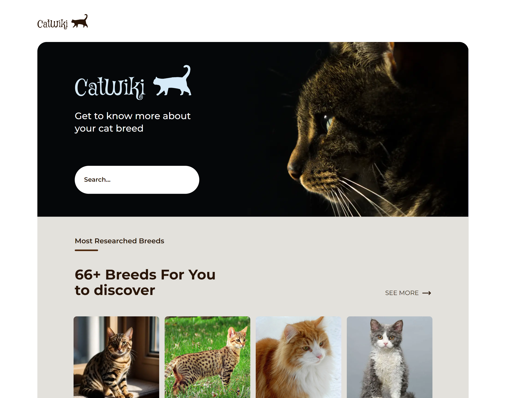

# Cat Wiki

  

This site lets you see the different characteristics, descriptions and photos of around sixty breeds of cat. 
In addition, an article presents the top 10 most popular and most researched breeds. 

The information on cat species comes from the [Cat API](https://thecatapi.com/).

    

## User stories

- [x] I can search for cat breeds and select a breed of my choice
- [x] I can see the most popular searched cat breeds summary on the homepage
- [ ] I can see the top 10 most searched cat breeds
- [x] I can see the breed details including description, temperament, origin, life span, adaptability, affection level, child-friendly, grooming, intelligence, health issues, social needs, stranger friendly
- [x] I can see more photo of the breed
- [ ] On mobile, when I select the search option, a modal for breed search should pop up
- [x] I can go to an article about cats when I click read more on Why you should have a cat section
- [x] I can go to the top 10 cats by clicking see more in the dashboard

## Built with

- Semantic HTML5 markup
- Mobile-first workflow
- TailwindCSS
- NextJS
- TypeScript
- CICD workflow

## Author

- Personnal website - [Portfolio](https://calcagno-loic.netlify.app/)
- Frontend Mentor - [@CalcagnoLoic](https://www.frontendmentor.io/profile/CalcagnoLoic)
- Linkedin - [LinkedIn](https://www.linkedin.com/in/loic-calcagno/)
