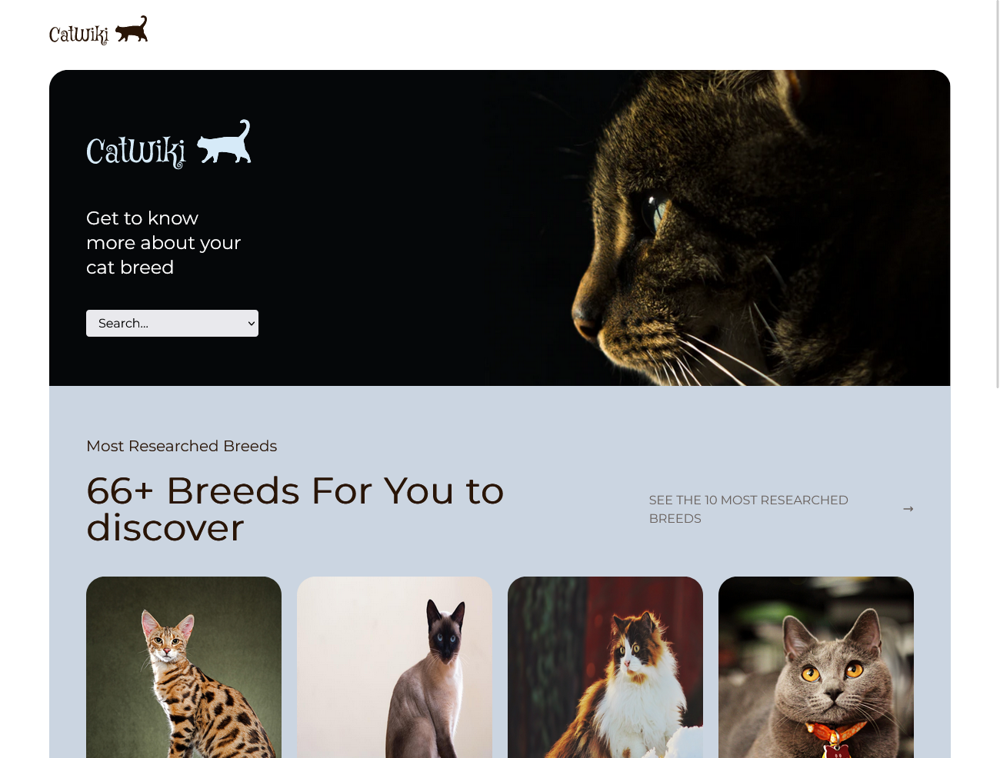

# Cat Wiki

    
    
    
    

    

This site lets you see the different characteristics, descriptions and photos of around sixty breeds of cat. 
In addition, an article presents the top 10 most popular and most researched breeds. 

The information on cat species comes from the [Cat API](https://thecatapi.com/).
