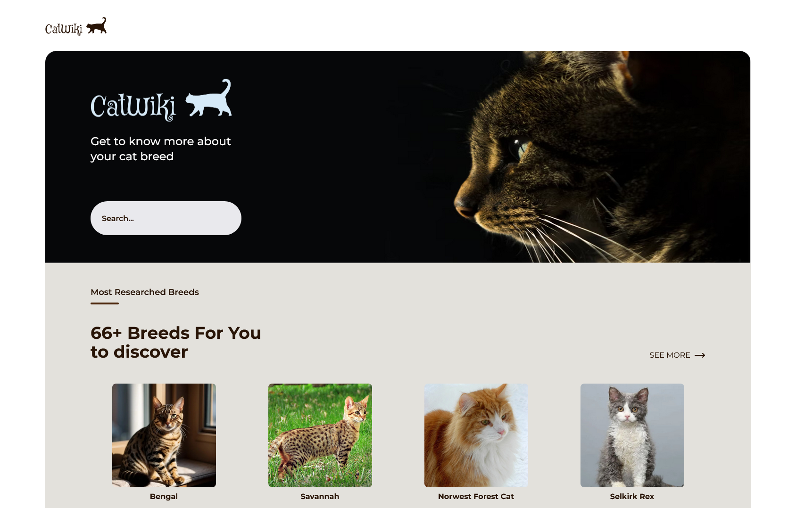
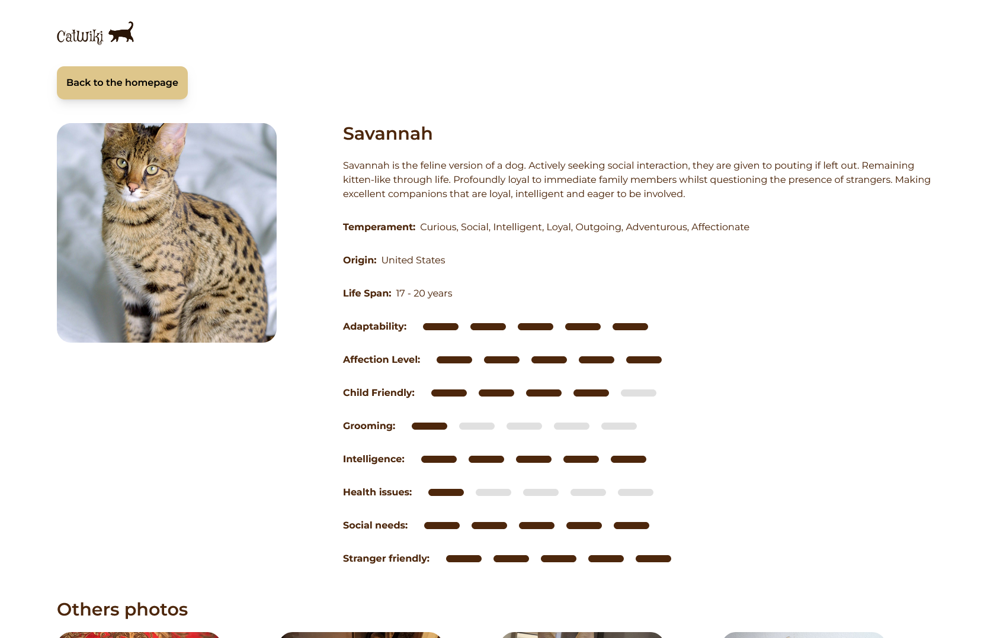
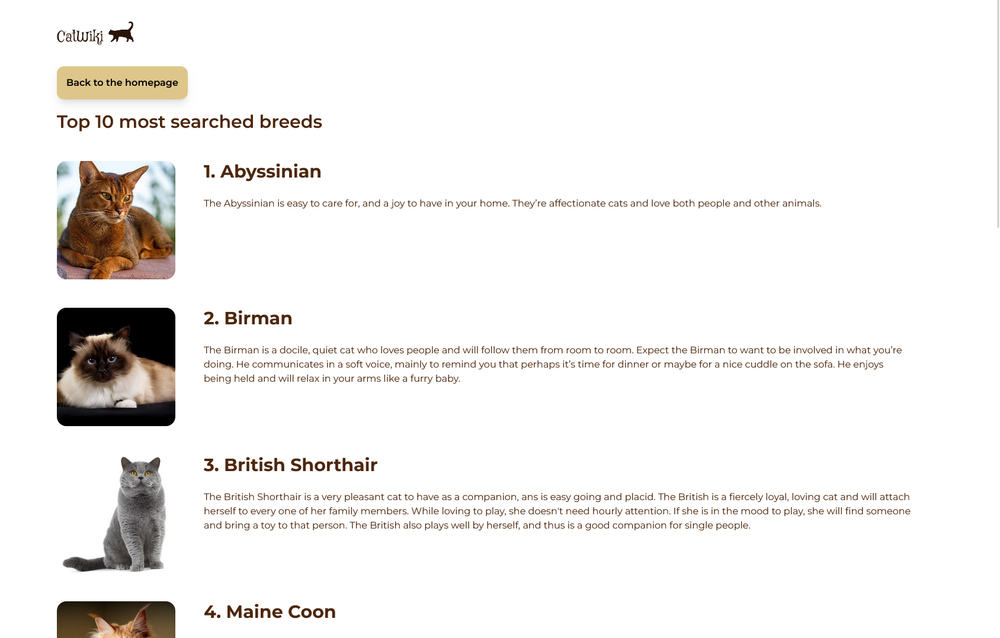

# CatWiki

  

Welcome to the cat lover's website! Here you'll find over sixty different breeds of cat. You can learn more about the breed's origin, life expectancy and other breed-specific criteria. In addition, the user has access to the 10 most sought-after breeds, as well as a blog article on the reasons for owning a cat.

Information and illustrations are taken from the [Cat API](https://thecatapi.com/).

    

| Details about a selected breed | The 10 most popular breeds           |
| ------------------------------ | ------------------------------------ |
|    |  |

## User stories

- [x] I can search for cat breeds and select a breed of my choice
- [x] I can see the most popular searched cat breeds summary on the homepage
- [x] I can see the top 10 most searched cat breeds
- [x] I can see the breed details including description, temperament, origin, life span, adaptability, affection level, child-friendly, grooming, intelligence, health issues, social needs, stranger friendly
- [x] I can see more photo of the breed
- [ ] On mobile, when I select the search option, a modal for breed search should pop up <kbd>Coming soon</kbd>
- [x] I can go to an article about cats when I click read more on Why you should have a cat section
- [x] I can go to the top 10 cats by clicking see more in the dashboard

## Built with

- Semantic HTML5 markup
- Mobile-first workflow
- TailwindCSS
- NextJS
- TypeScript
- CICD workflow

## Author

- Personnal website - [Portfolio](https://calcagno-loic.netlify.app/)
- Frontend Mentor - [@CalcagnoLoic](https://www.frontendmentor.io/profile/CalcagnoLoic)
- Linkedin - [LinkedIn](https://www.linkedin.com/in/loic-calcagno/)
